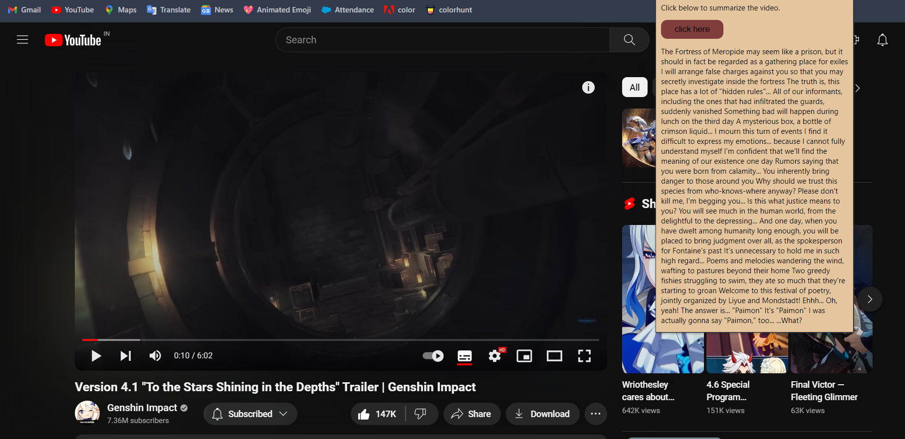

# YouTube Transcript Summarizer
This is a chrome extention built with Flask that allows users to summarize YouTube video transcripts. The application takes the transcript of a YouTube video using an API and generates a concise summary, making it easier for users to get a quick overview of the video's content.

# Installation
To run the YouTube Transcript Summarizer locally, follow these steps:
1. Clone the repository:
2. Run the flask server
   ```
   py app.py
   ```
3. Access the application:
4. Open Chrome and go to extensions and manage extensions.
5. Choose developer mode and select load unpacked extension.
6. Set the path to the downloaded folder and click ok, the extension is now enabled.

# Screenshot
</img>
